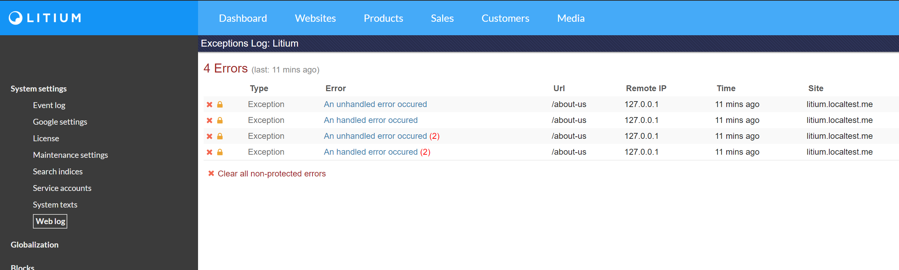

# Logging with StackExchange.Exceptional (WebLog)

**Tested in Litium version: 7.4 Beta**

The _Weblog_ (powered by _StackExchange.Exceptional_) was included as a logging option in Litium up until version 7.3. In version 7.4 the log was removed from the platform but this sample shows how to add _WebLog_ back into your solution if needed.

More information on StackExchange.Exceptional can be found at https://github.com/NickCraver/StackExchange.Exceptional

## Installation

1. First you need to run a SQL-script that adds and/or migrates the Exceptions table in the database, this script can be found here: https://github.com/NickCraver/StackExchange.Exceptional/blob/master/DBScripts/SqlServer.sql 
1. Then copy the folder _Resources/Litium.Community.ExceptionalWebLog_ to the _Src_-folder of your Accelerator solution
1. The folder contains a project that should be added to your Accelerator solution.
   1. Open the Solution Explorer in Visual Studio
   1. Right click the solution and select _Add > Esisting project..._
   1. Select the project file _Litium.Community.ExceptionalWebLog.csproj_ in the folder you just copied to the _Src_-folder
   1. Add a project reference from your _MVC_-project to the _Litium.Community.ExceptionalWebLog_-project 
1. On startup a new _configSection_ should be added in your Web.config-file, you should also get the WebLog menu option back in Litium backoffice:
   

## Using the log

```C#
try
{
    // Append will add a "Custom" section" to the log message in Exceptional
    // on the next write to the log.
    this.WebLog().Append("Custom model", currentPageModel);

    // Throw a handled exception
    throw new Exception("A handled error occured");
}
catch (Exception e)
{
    // To log a handled exception you should either inject the IWebLog interface in
    // the constructor and call _webLog.Error(), or use the extensionmethod as shown below:
    this.WebLog().Error(e);
}

// Any unhandled exception will also be written to the WebLog
throw new Exception("An unhandled error occured");
```